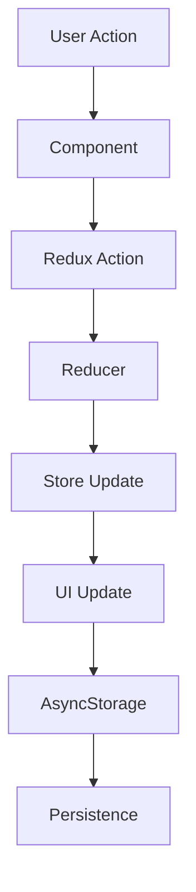

# React Native Comments App Documentation

## Table of Contents
1. [Project Overview](#project-overview)
2. [Architecture](#architecture)
3. [Component Structure](#component-structure)
4. [Data Flow](#data-flow)
5. [State Management](#state-management)
6. [Features](#features)
7. [Technical Implementation](#technical-implementation)

## Project Overview

This React Native application allows users to view and rate comments. It features:
- List of comments with ratings
- Star-based rating system
- Persistent storage of ratings
- Clean and modern UI
- Error handling

## Architecture

```
src/
  ├── components/
  │   └── Comment.js         # Individual comment component
  ├── screens/
  │   └── CommentsScreen.js  # Main screen
  ├── redux/
  │   ├── actions/
  │   │   └── commentActions.js
  │   ├── reducers/
  │   │   ├── commentReducer.js
  │   │   └── index.js
  │   └── store.js
  └── utils/
```

## Component Structure

### Comment Component
```javascript
const Comment = ({ comment }) => {
  const [currentRating, setCurrentRating] = useState(comment.rating);
  
  const handleRating = (rating) => {
    if (rating !== currentRating) {
      setCurrentRating(rating);
      dispatch(rateComment(comment.id, rating));
    }
  };
  
  return (
    <View style={styles.container}>
      <Text style={styles.title}>{comment.title}</Text>
      <Text style={styles.body}>{comment.body}</Text>
      <Rating
        type="star"
        ratingCount={5}
        imageSize={30}
        startingValue={currentRating}
        onFinishRating={handleRating}
      />
    </View>
  );
};
```

### CommentsScreen
```javascript
const CommentsScreen = () => {
  const dispatch = useDispatch();
  const comments = useSelector((state) => state.comments.comments);

  useEffect(() => {
    dispatch(loadSavedComments());
    dispatch(fetchComments());
  }, [dispatch]);

  return (
    <View style={styles.container}>
      <FlatList
        data={comments}
        renderItem={renderComment}
        keyExtractor={(item) => item.id.toString()}
      />
    </View>
  );
};
```

## Data Flow



## State Management

### Redux Store Configuration
```javascript
const store = configureStore({
  reducer: rootReducer,
  middleware: (getDefaultMiddleware) =>
    getDefaultMiddleware({
      serializableCheck: false,
    }),
});
```

### Actions
```javascript
export const fetchComments = () => async (dispatch) => {
  try {
    dispatch({
      type: FETCH_COMMENTS,
      payload: initialComments,
    });
  } catch (error) {
    console.error('Error fetching comments:', error);
  }
};
```

### Reducer
```javascript
const commentReducer = (state = initialState, action) => {
  switch (action.type) {
    case FETCH_COMMENTS:
      return {
        ...state,
        comments: action.payload,
        loading: false,
      };
    case RATE_COMMENT:
      return {
        ...state,
        comments: state.comments.map((comment) =>
          comment.id === action.payload.commentId
            ? { ...comment, rating: action.payload.rating }
            : comment
        ),
      };
    default:
      return state;
  }
};
```

## Features

1. **Comment Display**
   - Clean card-based layout
   - Title and body text
   - Star rating system

2. **Rating System**
   - 5-star rating
   - Real-time updates
   - Persistent storage

3. **Data Persistence**
   - AsyncStorage integration
   - Automatic saving
   - Error handling

4. **Error Handling**
   - Graceful error management
   - User feedback
   - Fallback mechanisms

## Technical Implementation

### Key Technologies
- React Native
- Redux Toolkit
- AsyncStorage
- React Native Ratings

### Best Practices
1. Component Separation
2. State Management
3. Error Handling
4. Performance Optimization
5. Code Organization

### Performance Considerations
- FlatList for efficient rendering
- Local state for UI updates
- Optimized Redux updates
- Proper error boundaries

## Workflow

1. **Initialization**
   - App loads
   - Redux store created
   - Comments loaded

2. **User Interaction**
   - User views comments
   - User rates comments
   - Updates saved automatically

3. **Data Flow**
   - UI updates
   - State changes
   - Storage updates

4. **Error Handling**
   - API errors
   - Storage errors
   - UI feedback 